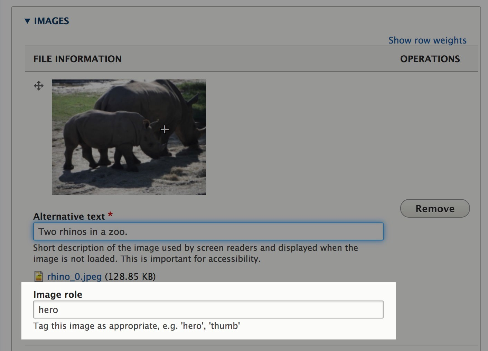
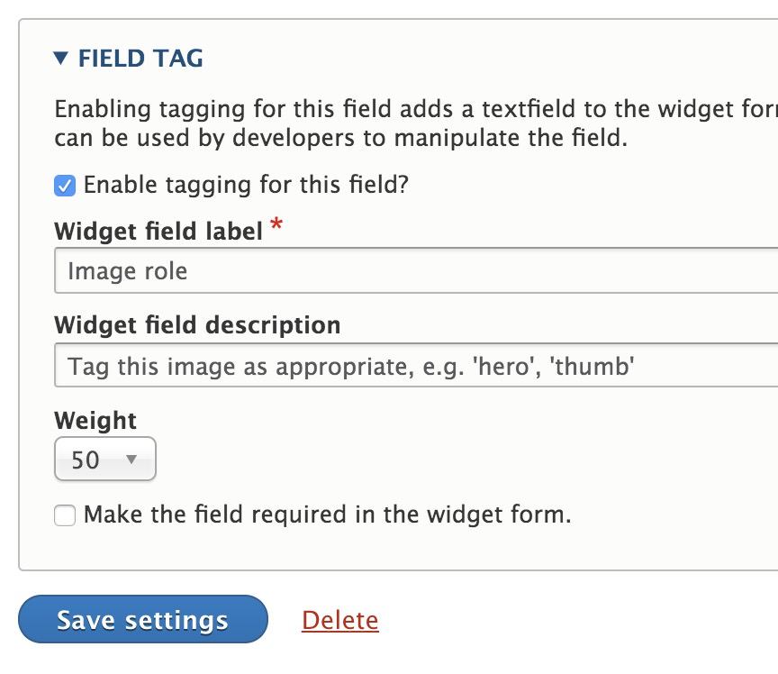

# Field Tag Drupal Module

## Summary

Provides a means to attach a tag-style input box to any entity field, which allows content managers to tag the field content.  Developers may take advantage of this additional metadata when manipulating fields.

The use case for which this was written is this.  Allow the tagging of images on an multiple value image field to indicate which image is the `hero` image, which image is the `thumb` image, and untagged images are just that.  It allows the content managers to indicate the role the image is playing for that given entity.

**Visit <https://aklump.github.io/field_tag> for full documentation.**

## About Tags

* The field tag input box is a CSV string separating one or more tags, e.g. `foo` or `foo, bar`.
* Tags are not case-sensitive.
* Tags may contain spaces.
* Tags must be unique; duplicates will be removed.

## Configuration

1. Enable this module.
1. Visit the _Manage fields_ page for the entity you've picked.
1. Click on the _Edit_ button for the given field.
1. Enable the _Field Tag_, and adjust settings as necessary.  
1. Give the permission _Use field tagging_ to the correct user roles.
1. Visit an entity edit page and make sure you see the tag field as configured.

## Developers

# Developers

* This provides the UI and storage mechanism for field content tagging.  It creates a new entity type _field_tag_.  It's up to you to implement use cases for the data.
* See _field_tag.api.php_ for code examples.
* **Never rely on the id of a field tag entity beyond the scope of a single request. The ids should be considered ephemeral.**
* The value of `fieldTag` on a `\Drupal\Core\Field\FieldItemInterface` is read only.  It gets added to the item when one calls `\Drupal\field_tag\FieldTagService::attachTags`.  It is completely ignored during entity save operations, and will be unset at that time.

* The value of `field_tag` on a `\Drupal\Core\Field\FieldItemInterface` is for entity save operations.  If present, this value will overwrite the existing value of the tag for that field item.  This is a string and represents the full tag value, which may be CSV of multiple tags, e.g., 'foo, bar'.

        $node->field_images->get(0)->field_tag = 'foo, bar, baz';
        $node->save();

* If `$entity->field_tag_sync`, an array, contains a field name of a tag-enabled field, then during entity save operations, all existing field tags for all items in that field will be deleted.  Then the field items will be iterated over and only those which have a `field_tag` value will have field tag entities created.  **You must understand how this works**, before you go programmatically handling field_tag CRUD operations.  For example.

        $item = $node->field_images->get(0)->getValue();
        $item['field_tag'] = 'new tag';
        $node->field_images->filter(function () {
          return FALSE;
        })->appendItem($item);
        
        // This line is VERY important because of the use of the filter method
        // above.  If you did not include this line, then you would potentially
        // have orphaned field tags.
        $node->field_tag_sync[] = 'field_images';
        
        $node->save();

* There is a PDF of manual tests which must suffice until other tests can be written.

## Migrations

Here's an example of how you might tag an image field during a migration, this assumes `field_images` has field tagging enabled and that 1) your source has no field tags or 2) you wish to replace those existing field tags.

    process:
      field_images:
        plugin: sub_process
        source: field_hero_images
        process:
          target_id: fid
          alt: alt
          title: title
          width: width
          height: height
          field_tag:
            plugin: default_value
            default_value: hero

And here is a migration where source has field tags and you wish to merge in new ones.
    
    process:
        # First copy over as is from source.
        field_images: field_images
        
        # Then add two tags to the first element only.
        field_images/0/field_tag:
          - plugin: field_tag_add
            source: field_images/0/field_tag
            field_tag: cover, card
          
## Contributing

If you find this project useful... please consider [making a donation](https://www.paypal.com/cgi-bin/webscr?cmd=_s-xclick&hosted_button_id=4E5KZHDQCEUV8&item_name=Gratitude%20for%20aklump%2Ffield_tag).

## Contact The Developer

In the Loft Studios  
Aaron Klump - Web Developer  
sourcecode@intheloftstudios.com  
360.690.6432  
PO Box 29294 Bellingham, WA 98228-1294  

<http://www.intheloftstudios.com>  
<https://github.com/aklump>  
