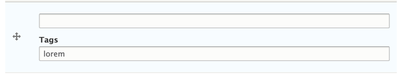

# Known Issues

## Cannot Tag Some Empty Items

If you try to add a tag to a textfield that is empty, and save the entity, the tag will not save.

However, if you tag an item and then later remove the value making it empty, the tag remains.

