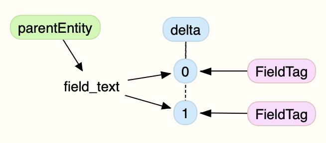

<!--
id: relationships
tags: ''
-->

# Relationships

The field tag entities are related to a given field on a parent entity. Specifically to a single delta on said field. In other words, the thing that is tagged by a `field_tag` entity can only be known when you have: entity + field + delta.

There is a possible further relationship **when the field is an entity reference field** such as a file field or a paragraph. In this case the field tag will be related to the target entity as well.

